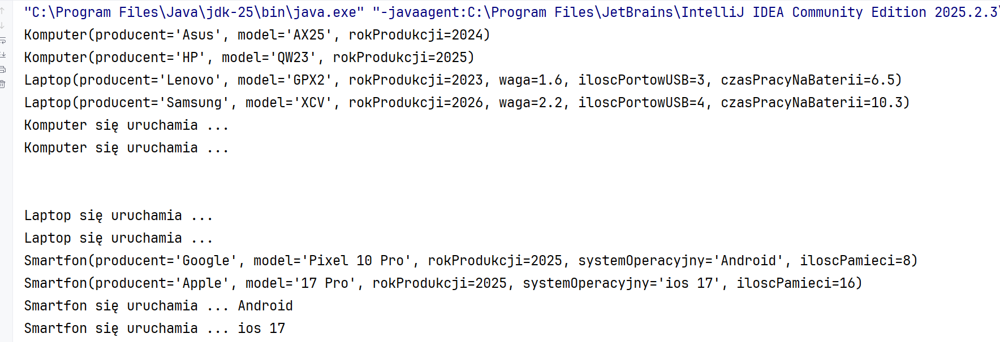

# Cw6JavaKlasyDziedziczenieKt

```kotlin
package komputery

open class Komputer(
    var producent: String = "",
    var model: String = "",
    var rokProdukcji: Int = 0
) {
    override fun toString(): String =
        "Komputer(producent='$producent', model='$model', rokProdukcji=$rokProdukcji)"

    open fun wlacz() {
        println("Komputer się uruchamia ...")
    }
}

package komputery

class Laptop(
    producent: String = "",
    model: String = "",
    rokProdukcji: Int = 0,
    var waga: Double = 0.0,
    var iloscPortowUSB: Int = 0,
    var czasPracyNaBaterii: Float = 0.0f
) : Komputer(producent, model, rokProdukcji) {

    override fun toString(): String {
        return "Laptop(producent='$producent', model='$model', rokProdukcji=$rokProdukcji, " +
                "waga=$waga, iloscPortowUSB=$iloscPortowUSB, czasPracyNaBaterii=$czasPracyNaBaterii)"
    }

    override fun wlacz() {
        println("Laptop się uruchamia ...")
    }
}
```